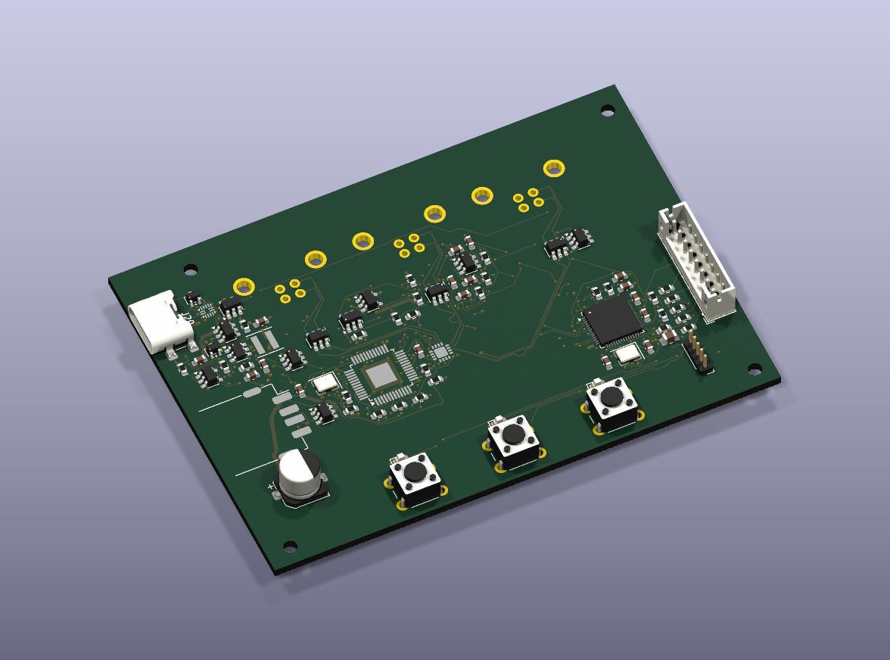

# Three-Host USB Keyboard Switch



> Work in progress: this image is a preliminary CAD rendering, not a fabricated prototype. Some connector models are absent, and the placement may change before fabrication.

## Project Owner

**GitHub:** [wichey66](https://github.com/wichey66)  
**Affiliation:** Virginia Tech / AMP Lab project proposal  
**Name and Virginia Tech email:** To be added by the project owner.

## Project Overview

This project is a desktop device that allows one USB keyboard to switch between three computers using three dedicated buttons. An integrated USB hub also connects a microcontroller to the selected computer, allowing a purchased IPS display to show CPU and memory utilization alongside simple pixel-art graphics.

The target keyboard is a Razer BlackWidow V4 75%. The hardware uses USB 2.0; compatibility with the keyboard's highest polling-rate mode remains a validation target, not a demonstrated result. Windows and macOS telemetry are planned through companion host software. Basic keyboard switching will not require the telemetry application.

The current scope excludes HDMI/DisplayPort switching. A 3D-printed enclosure and expanded graphics are future improvements.

## What I Hope to Learn

- USB 2.0 differential routing, reference planes, return paths, and interface protection.
- Four-layer PCB design, schematic review, and preparation of fabrication and assembly files.
- Embedded firmware for button handling, safe switching sequences, USB communication, and SPI displays.
- Windows/macOS system-data collection and communication with an embedded device.
- Prototype bring-up, fault isolation, and repeatable hardware validation.

## Design and Implementation

```text
Computer 1 --+
Computer 2 --+--> FSUSB74 selector --> TUSB4020BI USB hub --+--> Keyboard
Computer 3 --+                                            +--> RP2040 --> SPI IPS display
                     ^                                         |
                     +----------- selection control -----------+
                                                    Three buttons
```

### Main components

- **FSUSB74:** A bidirectional 4:1 USB 2.0 data switch rated for up to 480 Mbps. Three paths select the computer; the fourth is unused. This chip switches D+/D- signals, not VBUS power.
- **TUSB4020BI:** A two-port USB 2.0 hub. Its upstream port connects to the selector; its downstream ports connect to the keyboard and RP2040. Hub operation does not require custom application firmware.
- **RP2040:** Reads buttons, controls the selector and indicators, receives telemetry over its Full-Speed USB interface, and drives the display over SPI. External QSPI flash stores firmware.

Keyboard traffic passes through the hub and selector without being forwarded by the RP2040. Telemetry shares the selected computer's USB cable, so an additional telemetry cable per computer is unnecessary. Switching requires USB device re-enumeration; seamless or zero-delay switching is not claimed.

### PCB and power

The current design uses an approximately **85 x 60 mm, four-layer KiCad PCB**, a purchased **2-inch 320 x 240 SPI IPS display**, and a separate **5 V USB-C power input**. That USB-C input is for power, not an additional host-data connection. Host VBUS supplies must not be tied together, and backfeed protection must be reviewed and tested before connecting computers.

PCB routing is still in progress. Fabrication is pending design checks, manual review, and manufacturing-file verification. Fine-pitch SMT assembly is planned to be outsourced; through-hole assembly scope will be confirmed with the supplier.

## Bill of Materials

Planning allowances in USD, not supplier quotations. Board-component figures are for one assembled unit.

| Item | Quantity | Estimated Cost | Reference |
|---|---:|---:|---|
| FSUSB74 USB selector | 1 | $2 | [Datasheet](https://www.onsemi.com/download/data-sheet/pdf/fsusb74-d.pdf) |
| TUSB4020BI USB hub | 1 | $6 | [Datasheet](https://www.ti.com/lit/ds/symlink/tusb4020bi.pdf) |
| RP2040 microcontroller | 1 | $2 | [Datasheet](https://datasheets.raspberrypi.com/rp2040/rp2040-datasheet.pdf) |
| External flash and crystals | Set | $4 | Final sourcing pending |
| Power and protection ICs | Set | $18 | Final sourcing pending |
| Connectors, buttons, and LEDs | Set | $12 | Final sourcing pending |
| Passives and other support components | Set | $20 | Final sourcing pending |
| **Board components subtotal** | | **$64** | |
| IPS display and display cable | Set | $25 | Purchased module; supplier TBD |
| Bare four-layer PCBs | 5 | $30 | Fabrication quote pending |
| SMT setup, stencil, and assembly labor | Allowance | $150 | Assembly quote pending |
| USB cables and 5 V supply | Set | $30 | Sourcing pending |
| Shipping, tax, and sourcing charges | Allowance | $65 | Quote pending |
| Contingency | Allowance | $86 | |
| **Provisional prototype budget** | | **$450** | |

The budget assumes one assembled prototype and a five-board bare-PCB order. Supplier minimum quantities may change the cost. A second PCB revision is not included. Spending is subject to quotation review and approval.

## Timeline and Milestones

An estimated **8-10 weeks from project approval**, subject to supplier lead time.

| Milestone | Target | Status |
|---|---|---|
| Complete routing and design review; prepare Gerbers, BOM, and placement files | Weeks 1-2 | In progress |
| Obtain quote, fabricate, and outsource SMT assembly; develop software in parallel | Weeks 3-5 | Planned |
| Inspect assembly, validate power protection, and demonstrate three-host switching | Week 6 | Planned |
| Integrate IPS display and selected-computer CPU/RAM telemetry | Week 7 | Planned |
| Stress testing, fixes, documentation, and demonstration | Weeks 8-10 | Planned |

## Progress Log

### 2026-10-02

- Prepared a schematic draft, preliminary component selection, and a four-layer PCB layout in KiCad.
- PCB routing and layout refinement remain in progress; manufacturing files are not released.
- Prepared an AMP Lab proposal covering architecture, learning objectives, outsourced assembly, budget, and validation.
- Updated this repository's project overview and cover image.
- Fabrication, assembly, and bench validation have not yet been completed. Firmware and host software remain planned development tasks.

## Testing Methods

- Review electrical/design-rule results, USB routing, power paths, footprints, and assembly files before ordering.
- Inspect the assembled board and use a current-limited supply to check rails and backfeed before attaching computers.
- Perform at least 100 switching cycles across three hosts, recording failures and reconnection times.
- Target approximately 1 Hz telemetry updates; clear stale data when switching computers or losing the host connection.
- Test Windows/macOS operation and keyboard modes. GPU telemetry and 8 kHz keyboard compatibility are stretch validation items, not guaranteed features.

## Project Files

Currently published: this README and `hero.png`. Working KiCad files and proposal documents are maintained locally and have not yet been uploaded here.

Planned repository deliverables include reviewed KiCad sources, a BOM, firmware, host software, manufacturing documentation, and test results. Any design uploaded before validation will be labeled as preliminary and not fabrication-ready.

## Useful Links

- [FSUSB74 datasheet](https://www.onsemi.com/download/data-sheet/pdf/fsusb74-d.pdf)
- [TUSB4020BI datasheet](https://www.ti.com/lit/ds/symlink/tusb4020bi.pdf)
- [RP2040 datasheet](https://datasheets.raspberrypi.com/rp2040/rp2040-datasheet.pdf)
- [Hardware design with RP2040](https://datasheets.raspberrypi.com/rp2040/hardware-design-with-rp2040.pdf)
- [AMP Lab getting started](https://amp-lab.org/getting_started)

## Project Image

`hero.png` is a preliminary KiCad render of the IPS/hub PCB design. It is retained at the repository root with this filename for the AMP Lab website. It does not establish manufacturing readiness or successful hardware operation.
